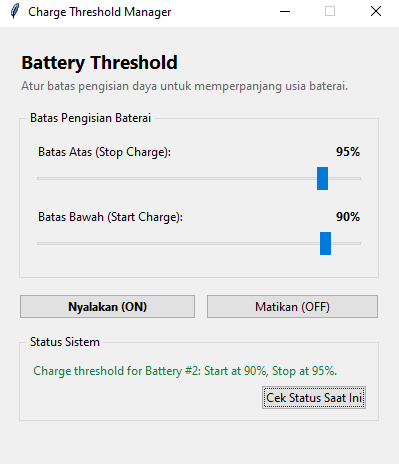

# BatreConservation - Charge Threshold Manager

**BatreConservation** adalah aplikasi desktop GUI (Graphic User Interface) berbasis Python yang berfungsi sebagai antarmuka (wrapper) untuk mengontrol fitur *Charge Threshold* baterai pada laptop Lenovo ThinkPad T480 secara mudah, cepat, dan senyap (di latar belakang).

Aplikasi ini mengontrol executable `ChargeThreshold.exe` yang tersimpan di sistem (`C:\System\App\ChargeThreshold.exe`) tanpa perlu lagi mengetikkan perintah di Command Prompt secara manual.

> **Status:** Optimized for Lenovo ThinkPad T480 (Windows 10/11)

---

## Antarmuka Aplikasi (UI/UX)

Aplikasi hadir dengan desain *native* yang bersih dan modern untuk memberikan kenyamanan penggunaan harian:

| Antarmuka Utama |
| :---: |
|  |

---

## Fitur Utama

* **Kemudahan Pengaturan (Slider Control):** Geser slider untuk menentukan batas *Stop Charge* (Batas Atas) dan *Start Charge* (Batas Bawah) secara real-time.
* **Mode Senyap (Background Process):** Eksekusi perintah `ChargeThreshold.exe` berjalan 100% di latar belakang tanpa memunculkan jendela hitam Command Prompt (CMD).
* **Monitoring Status Otomatis:** Menampilkan output informasi baterai (seperti persentase batas aktif) langsung di dalam jendela utama aplikasi.
* **Kontrol Sekali Klik:** Mematikan atau menyalakan *threshold* cukup dengan satu klik tombol.

---

## Cara Kerja Sistem

Aplikasi GUI ini bertindak sebagai antarmuka kontrol yang mengirimkan argumen ke `ChargeThreshold.exe`:

* **Nyalakan (ON):** Menjalankan perintah `ChargeThreshold.exe on <Batas_Atas> <Batas_Bawah>` (contoh: `on 95 90`).
* **Matikan (OFF):** Menjalankan perintah `ChargeThreshold.exe off`.
* **Cek Status:** Menjalankan perintah `ChargeThreshold.exe status` dan memperbarui teks pada area *Status Sistem*.

---

## Persyaratan Sistem

1. **Sistem Operasi:** Windows 10 / 11 (64-bit).
2. **Perangkat:** Lenovo ThinkPad T480 (atau model ThinkPad yang didukung).
3. **Executable Pendukung:** File `ChargeThreshold.exe` berada di path `C:\System\App\ChargeThreshold.exe`.
4. **Python:** Python 3.x (jika menjalankan dari *source code*).

---

## Panduan Penggunaan

1. **Buka Aplikasi:**
   Jalankan file script Python atau executable GUI sebagai **Administrator** (diperlukan agar sistem diizinkan mengubah konfigurasi daya baterai).
2. **Atur Batas Baterai:**
   * **Batas Atas (Stop Charge):** Tentukan batas maksimal pengisian (misal: **95%**).
   * **Batas Bawah (Start Charge):** Tentukan kapan baterai mulai diisi ulang kembali saat ditancapkan adaptor (misal: **90%**).
3. **Terapkan Pengaturan:**
   * Klik tombol **Nyalakan (ON)** untuk mengaktifkan batas daya.
   * Klik tombol **Matikan (OFF)** jika ingin mengisi daya penuh hingga 100%.
4. **Periksa Status:**
   Status pengisian baterai akan diperbarui secara otomatis di bagian card **Status Sistem** atau dengan mengklik **Cek Status Saat Ini**.

---

## Catatan Penting

* Pastikan file `ChargeThreshold.exe` tersedia pada folder `C:\System\App\`.
* Nilai **Batas Bawah** tidak boleh lebih besar atau sama dengan **Batas Atas**.
* Fitur *Charge Threshold* memerlukan driver sistem daya Lenovo yang terpasang dan dukungan BIOS pada laptop Anda.

---

## Lisensi

MIT License